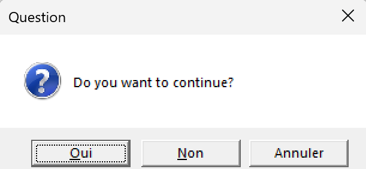

In this blog post you can find a quick tutorial on how to install the package **torch** in Rstudio.

## Introduction

The torch library is often used for machine learning, in python it's known as PyTorch.  
You can find out more about the use of torch in R [here.](https://torch.mlverse.org)

## Installing the package

To install the package torch open a RStudio and in the console copy and paste the following lines of code.

```{r, eval=FALSE}
install.packages("torch")
```

```{r, eval=FALSE}
library(torch)
```

When you run this command you might get the following message: 
```{r, eval=FALSE}
> library(torch)
ℹ Additional software needs to be downloaded and installed for torch to work correctly.
```


And you should have a new app open, you can click on the icon to view it.  


When you open the window you should get the following: 





To finalise the installation of torch you should click on yes, or the leftmost button.
 
Then you can run the following command to check if the package is installed.

```{r, eval=FALSE}
torch::torch_is_installed()
```

If the call returns `TRUE` you have successfully installed torch in your RStudio !
If not you can try and run the following command befire re-runing the command above.

```{r, eval=FALSE}
torch::install_torch()
```

